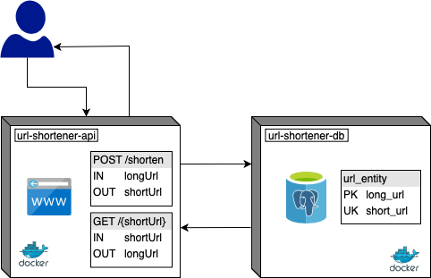

# Url Shortener Application
REST Application to create an alias for a given url, denominated short url.

_Author: Júlia Zottis Moreira_

## Available Endpoints

| Operation | Path | Successful Status Code | Description |
|-----------|------|------------------------|-------------|
| POST | /shorten | 200 OK | Create a short url alias for a given url |
| GET | /{shortUrl} | 302 FOUND | Exchange a short url alias for its corresponding long url |

### Requirements
* Payload must be on JSON format

### Constraints
The service will produce the same short url alias when receiving the same long url:
   1) Two urls are the same when all characters are equal and in the same order.
   2) Two urls are the same when one has schema **http://** and the other has no schema at all, 
    and the rest of the url (beyond the schema) complies with item 1.
   3) For all other cases, urls are different.
   
## Architecture


The system is designed as two separate Docker containers, one for the application, named url-shortener-api
 and  one for the database, named url-shortener-db. The container image for the database is downloaded as is
 from the Docker Hub, the container image for the application needs to be built for the first deployment, the 
 instructions are below.
 
 A container orchestration system can be used to scale the system horizontally by adding more replicas of the 
 application container. 

## Deployment
### Prerequisites
* Java JDK 1.11
* Maven 3.6.2
* Docker 19.03.2
* An active account on Docker Hub

### Running Unit Tests
There are 24 unit tests that set the line coverage to 80%.

To run only unit tests:
```
$ mvn clean test -Dtest=!UrlShortenerAppIntegrationTest
```

Unit Test coverage is provided by JaCoCo, you can find the report at `./target/jacoco-coverage/index.html`.

### Running Integration Tests
There are 23 integration tests that set the Line coverage to 88%.

All integration tests are located in class [UrlShortenerAppIntegrationTest](./src/test/java/org/juliazo/url/shortener/UrlShortenerAppIntegrationTest.java).

The application uses the library Testcontainers in order to create a single use container for the database to 
 be used by the integration tests. During each execution, a database container will be created, used by the test, 
 and then destroyed. In order to run the tests you must have your Docker up and running.

To run only integration tests:
```
$ mvn clean test -Dtest=UrlShortenerAppIntegrationTest
```

Integration Test coverage is provided by JaCoCo, you can find the report at `./target/jacoco-coverage/index.html`.

### Running Application
This is a Maven Spring Boot application that uses Postgres DB and is packaged into Docker containers, to run it, follow these steps:
#### 1) Build the code and create a Docker Image for the Service
```
$ mvn clean install dockerfile:build
```
* All unit and integration tests will be executed;
* Application will not compile if there is any test failure;
* Coverage for all tests will available at `./target/jacoco-coverage/index.html`;
#### 2) Instantiate the containers and run the application
```
$ docker-compose up
```
#### 3) Have fun!
You can access the app at `http://localhost:80`.

### Examining Logs
SLF4J was used to provide logs for this application. All logs are being shown in the console and printed out to a file.

Log level can be changed at [Application.properties](./src/main/resources/application.properties). Default level is INFO 
for classes inside [juliazo](./src/main/java/org/juliazo) package and ERROR for spring framework related classes.

Log files can be found in `./logs/application.log`.

## Examples

### POST to /shorten
#### Case: Creating a short url alias

```
REQUEST
POST /shorten HTTP/1.1
HOST: http://localhost:80
Content-Type: application/json

{
	"longUrl": "https://theuselessweb.com"
}

```

```
RESPONSE
HTTP/1.1 200 OK
Content-Type: application/json;charset=UTF-8
{
    "longUrl": "https://theuselessweb.com",
    "shortUrl": "http://localhost:80/6c2f62"
}
```

#### Case: Sending empty url

```
REQUEST
POST /shorten HTTP/1.1
HOST: http://localhost:80
Content-Type: application/json

{
	"longUrl": ""
}

```

```
RESPONSE
HTTP/1.1 400 BAD REQUEST
Content-Type: application/json;charset=UTF-8
{
    "status": 400,
    "reasonPhrase": "Bad Request",
    "message": "The provided url is malformed or otherwise invalid."
}
```

#### Case: Sending long url that results in too many conflicts in the database

_Note: This is an example, it does not mean this url will cause a conflict 
when you attempt to reproduce this request. Conflicts are some what rare, but likely to occur._

```
REQUEST
POST /shorten HTTP/1.1
HOST: http://localhost:80
Content-Type: application/json

{
	"longUrl": "http://www.republiquedesmangues.fr"
}

```

```
RESPONSE
HTTP/1.1 409 CONFLICT
Content-Type: application/json;charset=UTF-8
{
    "status": 409,
    "reasonPhrase": "Conflict",
    "message": "All attempts to create a short url resulted in conflicts, please try a different URL."
}
```

### GET to /{shortUrl}
#### Case: Exchange an already created short url

_Note: You may get redirected too fast and end up only seeing the actual website and not the redirect response._

```
REQUEST
GET /9b658a HTTP/1.1
Host: http://localhost:80
```

```
RESPONSE
HTTP/1.1 302 FOUND
Content-Type: application/json
Location: https://www.nationalaquarium.co.nz/animals-and-fish/penguin-of-the-year/
```

#### Case: Exchange a short url that has no corresponding long url

```
REQUEST
GET /b65fd3 HTTP/1.1
Host: http://localhost:80
```

```
RESPONSE
HTTP/1.1 404 NOT FOUND
Content-Type: application/json
{
    "status": 404,
    "reasonPhrase": "Not Found",
    "message": "The requested short url was not found."
}
```

## Improvements
* Not use the database password in plain text;
* Add a cache solution in case the response time is not low enough;
* Check long url for malicious scripts;
* Logs and error messages could be better formatted to improve autonomous indexing and analysis;
* Improve error messages;
* Use a container orchestrator to run multiple replicas of the service, Kubernetes support 
can be added with aid of Kompose to translate the docker-compose configuration into
Kubernetes configuration.

## Support
If you have any question, please send me an [email](mailto:juliazottis@hotmail.com).

